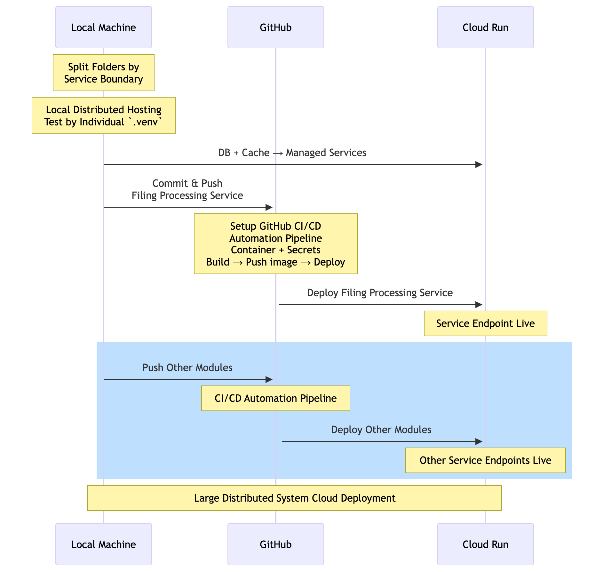

# graph-rag-finance-assistant

GraphRAG assistant for SEC filings + market data Q&amp;A with cited evidence

### Phase 4 Checklist
- [x] Search and design a distributed microservice system with professional system design diagram and industrial standard endorsed. 
- [x] Break the current project file structure from monolith to distributed locally.
- [ ] Push the project to GitHub then start from SEC microservice deployment, make the service endpoint live and build CI/CD automation pipeline. 
- [ ] Repeat the process for other parts, search agent, LLM etc. handle the database, Redis and cache management. 
- [ ] Check industrial standard metrics, e.g. latency, make sure they are all working well

